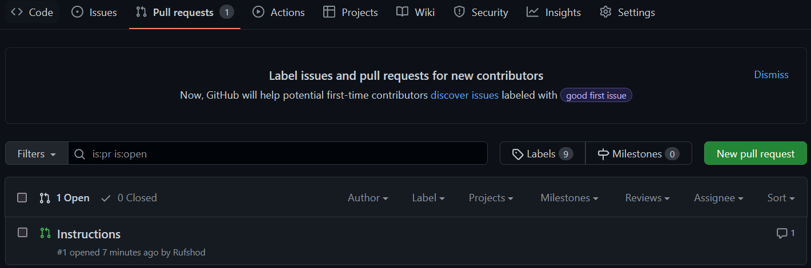

# git-branches
exercise in creating and working with git branches

Adding first line

## Instructions branch

Nu skapar vi en branch som heter instructions. Detta gör vi med hjälp av kommandot

```md
git checkout -b instructions
```

För att pusha upp ändringa till denna branch behöver vi först stage, commit och pusha. för push till enna branch gör vi

```md
git push origin instructions
```

Flr att checka branches vi har:

```md
git branch
```
---
## Pull request

För att få merga in ändringar från denna branch in till main så öppnar vi en pull request. Detta gör vi i fliken pull request i github.



## Merge

Efter pull request är det viktigt att varje person kör en pull till sin main branch och pull till sin egna branch.